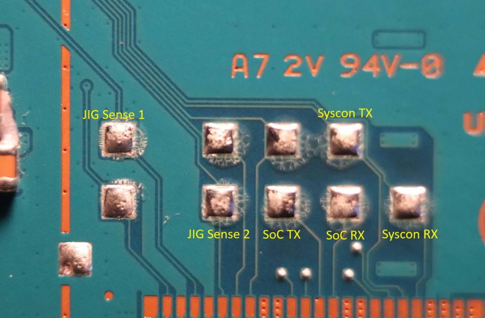
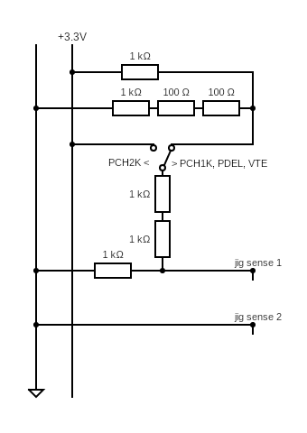

# bert
*"Bert"* is a nickname given to a UART RPC interface client of PSP2's System Controller.
<br><br>
The PlayStation Vita/TV's System Controller - codenamed *"Ernie"* - is a low-power MCU that handles peripherals such as PMIC, USB controller, physical buttons, touch panels and more. 
It hosts a RPC server accessible from multiple interfaces, each of which has its own set of available commands.<br>
One of the interfaces is UART, enabled by a special *"jig"* circuit that sets specific voltage levels on syscon's voltage sense pins/probes. 
This interface exposes around 100 RPC commands ranging from simple peripheral details retrieving to more complex procedures such as flash programming or alternative SoC boot modes.<br>
In this repository you will find documentation, schematics, diagrams and scripts for interacting with Syscon over the UART interface.
<br><br>

## Hardware
Supported units:
 - DEM-3000 : **only IRT-002**
   - unknown interface-enable procedure on IRT-001 / *"slideys"*
 - CEM-3000 : **supported**
 - PDEL-1000 : **supported**
 - PCH-1000 : **supported**
 - VTE-1000 : **supported**
 - PCH-2000 : **supported**

For all supported units, the UART interface logic level is 1.8v.

### PCH-1000, DEM-3000, CEM-3000, PDEL-1000
On those units, the circuit probes as well as Syscon UART are exposed via the [MultiConnector](https://wiki.henkaku.xyz/vita/UDC#PCH-1XXX_Pinout).
 - Pin 6: Syscon RX
 - Pin 7: Syscon TX
 - Pin 11: Jig Sense 1
 - Pin 12: Jig Sense 2
 - Pin 14: GND

The UART interface is enabled if the *"Jig Sense 1"* probe is at 0.47v-0.738v during *"Jig Sense 2"* probe state change.<br>
State change can be achieved by connecting the probe to GND using a button or jumper wire.<br>
A [MultiConnector breakout board](https://github.com/SKGleba/bert/blob/main/PCBs/multicn-UDC-breakout-kicad.zip) is recommended. 
The biggest challenge is finding a populated connector, we found that the **PCH-ZCL1** *"Sony PlayStation Vita Cradle"* has one, but it is hard to source.<br>
Another possibility is using the motherboard's tiny testpads, or lifting and moving pins on a retail USB MultiConnector cable.<br>

### VTE-1000
On this unit, the circuit probes as well as Syscon and SoC UART are exposed via the [Service Connector](https://www.psdevwiki.com/vita/Service_Connectors).
 - Pin 1: GND
 - Pin 4: Jig Sense 1
 - Pin 6: Jig Sense 2
 - Pin 13: SoC TX (useful)
 - Pin 14: SoC RX (useful)
 - Pin 19: Syscon TX
 - Pin 20: Syscon RX

It is recommended to use the big testpads above the flat connector:



The UART interface is enabled if the *"Jig Sense 1"* probe is at 0.47v-0.738v during *"Jig Sense 2"* probe state change.<br>
State change can be achieved by connecting the probe to GND using a button or jumper wire.

### PCH-2000
On this unit, the circuit probe as well as Syscon UART are exposed via [microUSB](https://wiki.henkaku.xyz/vita/UDC#PCH-2XXX_Pinout).
 - Pin 2: D- : Syscon TX
 - Pin 3: D+ : Syscon RX
 - Pin 4: ID : Jig Sense
 - Pin 5: GND

The UART interface is enabled if the *"Jig Sense"* probe is at 1.017v-1.14v for at least 32000 Syscon clock cycles. When enabled, a *"UUU"* hello packet is sent over UART.<br>
A microUSB breakout board is recommended, it is also possible to use the motherboard's big testpads.

### AIO
The following circuit will enable the Syscon UART interface on all supported units:


<br><br>

## Software
The UART RPC interface protocol is a simple message -> reply packet interaction, structured as below:
```C
struct _ernie_cmd {
    uint16_t id; // Command ID
    uint8_t ret; // 0x00 for message, return status for reply
    uint16_t data_size;
    uint8_t data[data_size];
    uint16_t checksum; // ~(all bytes added)
} _ernie_cmd;
```
Each packet is converted to/from ASCII and ends in CRLF, max packet size is 0x40 bytes (ascii 0x80).

### Message
A list of all available commands can be found [in commands.md](commands.md).

### Reply
The reply contains a command return status, currently the following status IDs are known:
 - 0x0 : "OK"
 - 0x1 : "UNK_CMD"
 - 0x2 : "BAD_LEN"
 - 0x3 : "BAD_CHKSUM"
 - 0x4 : "NO_CRLF"
 - 0x5 : "BAD_CMD_FORMAT"
 - 0x10 : "LOCKED_HANDSHAKE"
 - 0x20 : "LOCKED_T1"
 - 0x32 : "BAD_ARG_SIZE"
 - 0x33 : "BAD_ARG"
 - 0x40 : "WRONG_STATE"
 - 0x50 : "WRONG_POWER_STATE"

### Locks
Some commands are locked behind *"locks"* - bits that can be set using other commands.<br>
For example the power control command - 0x105 - requires the T1 *"lock"* to be removed/unlocked by first calling cmd 0x103.<br>
Some commands, such as NVS-read (0x131), might be locked behind multiple *"locks"* - here besides T1, the T8 lock needs to be removed/unlocked first by performing a 3-step keyset 0x1 handshake with cmd 0x110.<br>
Full list of commands with their locks can be found [there](https://github.com/SKGleba/bert/blob/main/commands.md#command-offset-lock) <br>
Un/lock, where Tx is the *"lock"* bitmask:
 - T1: 0x103 / 0x104
 - T2: 0x110 keyset 0x1
 - T4: 0x900 with key / 0x901
 - T8: 0x110 keyset 0xE

### The Script
Provided is a python script that can be used to communicate with the RPC server over UART.<br>
 - requires pyserial, pycryptodome, python 3.10+
```
bert.py raw [COMMAND]                               : send a raw command, only adds checksum           : -----
bert.py nop                                         : ping ernie                                       : 0x100
bert.py mode [USE_FAST?] [USE_BIN?]                 : [true/false] 115200 and binary uart modes        : 0x102
bert.py info                                        : get hardware & ernie info                        : 0x101
bert.py get-date-string                             : get ernie firmware date string                   : 0x107
bert.py power-off / power-on / power-fsm            : set new power state                              : 0x105
bert.py get-power                                   : get current power state                          : 0x106
bert.py get-kr600                                   : read some ID with overlord command 4, off 0x120  : 0x120
bert.py maika-0 [OFFu16]                            : read some data with overlord command 0           : 0x121
bert.py nvs-read [OFFu16] [SIZEu8]                  : read nvs                                         : 0x131
bert.py nvs-read-range [OFFu16] [ENDu16] [STEPu8]   : read and print nvs in STEP-sized blocks          : -----
bert.py nvs-write [OFFu16] [SIZEu8] [DATA]          : write nvs                                        : 0x132
bert.py confzz-ro / confzz-rw                       : block/allow confzz writes                        : 0x144 / 0x143
bert.py confzz-read [OFFu16] [SIZEu8]               : read confzz                                      : 0x141
bert.py confzz-read-range [OFFu16] [ENDu16] [STEPu8]: read and print confzz in STEP-sized blocks       : -----
bert.py confzz-write [OFFu16] [SIZEu8] [DATA]       : write backup confzz                              : 0x142
bert.py confzz-apply                                : write backup confzz to main confzz               : 0x145
bert.py invs-read [OFFu16] [SIZEu8]                 : read internal nvs                                : 0x154
bert.py invs-read-id [IDu8]                         : read internal nvs by id                          : 0x153
bert.py invs-read-range [OFFu16] [ENDu16] [STEPu8]  : read and print internal nvs in STEP-sized blocks : -----
bert.py wipe-nvs                                    : wipe NVS with 0xFF                               : 0x160
bert.py reset / reset-hard                          : soft-reset / hard reset ernie                    : 0x161 / 0x162
bert.py kill                                        : full, hard shutdown of all components            : 0x163
bert.py reset-bic                                   : reset the battery controller                     : 0x182
bert.py unlock-1 / lock-1                           : un/lock the T1 lock                              : 0x103 / 0x104
bert.py unlock-4 / lock-4                           : un/lock the T4 lock with a passcode              : 0x900 / 0x901
bert.py handshake-0 / handshake-1 / handshake-E     : authenticate with the selected keyset            : 0x110
bert.py unlock-qa                                   : unlock the T1 and T8 locks                       : 0x103 + 0x110 (E)
bert.py unlock-nvs                                  : unlock the T1 and T2 locks                       : 0x103 + 0x110 (1)
bert.py unlock-sdboot                               : unlock the T1 lock and boot into SD mode         : 0x103 + 0x110 (0)
bert.py unlock-all                                  : unlock 1,4,qa,nvs,sdboot                         : -----
bert.py [COMMANDu16] <SIZEu16> <DATA>               : execute a command, e.g. '0x105 0x2 03'           : -----
```
<br>

## Notes
 - Some breakout/jig PCB schematics and gerber files can be found in [PCBs](PCBs)
 - Alternative JIG schematics can be found in [schematics](schematics)
 - This project is WIP, the syscon firmware is still being reversed and commands documented.
    - It is not recommended trying unknown commands, they might cause an unrecoverable brick
<br><br>

## Credits
This project was made in collaboration with Proxima.<br><br>
Additional thanks to:
 - yifanlu, for initial syscon JIG research and documentation
 - pop13_13, for help with finding the PCH-2000 JIG circuit
 - S1ngyy, for help with finding the PCH-1000 JIG circuit
 - xyz, for help with finding the VTE-1000 JIG circuit
 - Mathieulh, for alternative PCB schematics and circuits
 - d3s, for the multiCn breakout board
 - Everyone that contributed ideas, tested and helped debug the JIG circuits
 - [henkaku wiki](https://wiki.henkaku.xyz) contributors.
